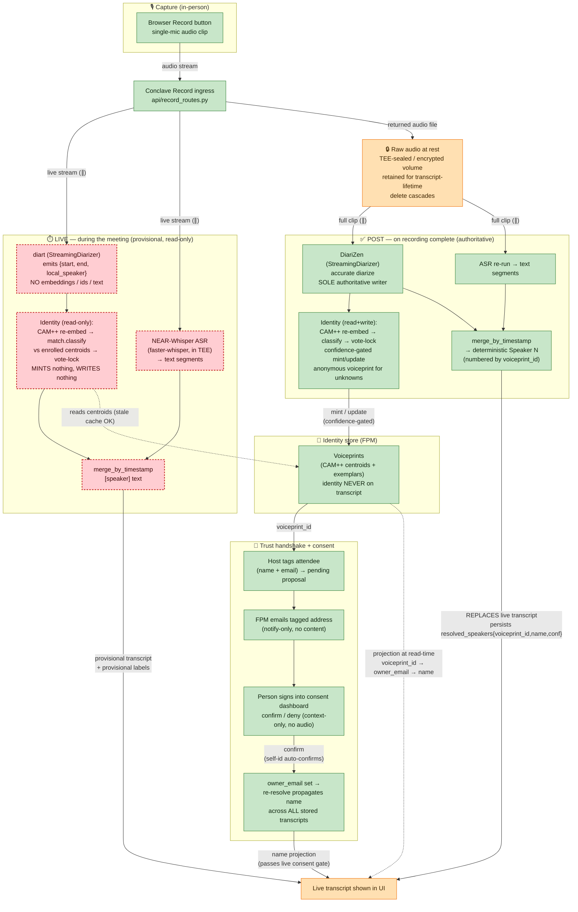

# Diarization Flow

Source of truth: `FPM/docs/build/ARCHITECTURE.md`. This is the visual companion — when
transcription happens, when diarization happens, where raw audio goes.

The spine: **identity lives on the voiceprint, never on the transcript**, and the
**display name is always a projection** (`voiceprint_id → owner_email → name`). Two
diarization engines, **one identity store, one writer**.

**Status colors** (verified against the code on 2026-06-19):

| Color | Meaning |
|---|---|
| 🟩 **green** | Implemented & wired end-to-end |
| 🟧 **amber** | Partial — exists/runs, but not fully as drawn |
| 🟥 **red (dashed)** | Not implemented as a live path |

**What's actually built vs. drawn:**

- 🟩 **The whole POST pass + capture + identity + consent loop is real.** Browser Record → `record_routes.py` (ffmpeg → FPM `/v1/diarize` ∥ NEAR-Whisper ASR → `merge_by_timestamp` → `resolved_speakers`) runs as a single **offline** pass on the finished clip. DiariZen is the default engine; identity (CAM++ re-embed, `match.classify`, vote-lock, confidence gate, anonymous mint) and the full host-tag → FPM-email → confirm → re-resolve handshake are all on `main`.
- 🟥 **The entire LIVE column is not operational.** Conclave only ever calls FPM with `tag=offline` on the whole clip — there is **no streaming/during-meeting diarization, no live ASR, no live merge**. The `diart` engine and the `read_only` "live" identity mode *exist in FPM code* but are never invoked as a live path (and `diart` isn't even the default engine), so functionally the live pass doesn't run.
- 🟧 **RAW audio at rest** — audio is decoded **in-memory per request and never persisted**; voiceprints are AES-encrypted at rest, but there is no audio-at-rest sealing, transcript-lifetime retention, or delete-cascade to audio/transcript.
- 🟧 **DISPLAY** — the **final** transcript is shown in the UI; the **live/provisional** transcript and the live→post "replace" reconciliation are not (the record UI shows only an elapsed-time counter while recording).

> **Net:** what's implemented is essentially a clean single-pass **offline** diarization + the consent/identity spine. The "two-engine live + post" split this diagram depicts is currently **post-only** — the live half is the unbuilt portion (matches the P1 "live diart read-only" branch in `build/ARCHITECTURE.md`, which is not on `main`).

## Reading it in one breath

1. **Capture** — single mic, browser Record → Conclave ingress.
2. **Transcription happens twice** — ASR runs in *both* the live and post passes,
   always in **parallel (∥)** with the diarizer, never as a pipeline stage after it.
   Diarizer and ASR are merged by timestamp into `[speaker] text`.
3. **Diarization happens twice, two engines:**
   - **LIVE = `diart`** — provisional, **read-only**: labels speakers for display,
     mints nothing, writes nothing.
   - **POST = `DiariZen`** — runs on the returned audio file, **sole authoritative
     writer**: accurate diarize + identify, confidence-gated mint/update, and its
     result **replaces** the live transcript. One writer ⇒ no cache-coherence problem.
4. **Raw audio** flows to a **TEE-sealed / encrypted** store, feeds the post pass,
   is retained for transcript-lifetime, and delete cascades (audio + transcript + voiceprint).
5. **Identity is never on the transcript** — it's a voiceprint id; the **name is a
   read-time projection** `voiceprint_id → owner_email → name`, set only after the
   email-bound consent handshake confirms.
