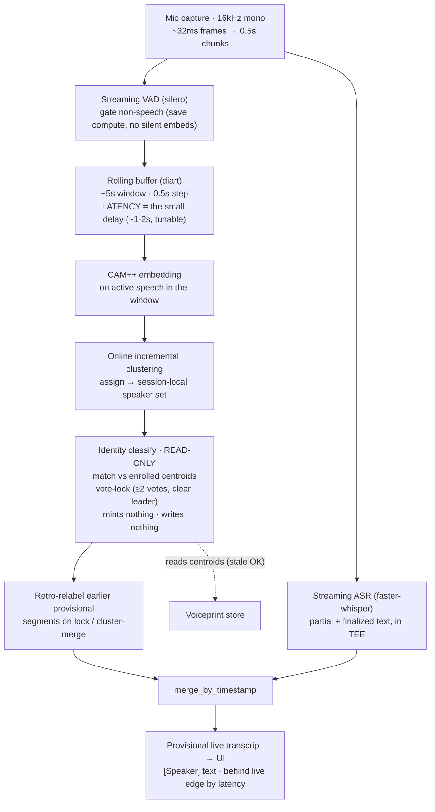
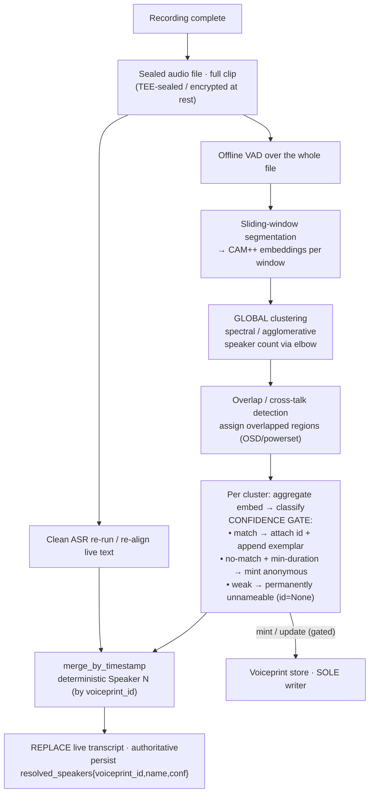
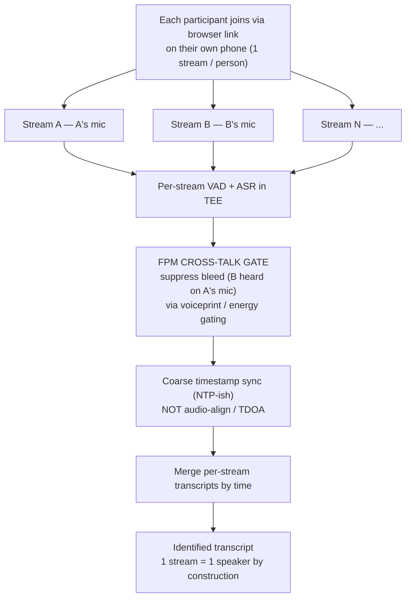

# Ideal Diarization Flow (target design)

Companion to `diarization-flow.md` (current) and `build/ARCHITECTURE.md` (spec). This is the
**target** shape for each pass. Governing principles, unchanged:

- **Live trades accuracy for latency; post trades latency for accuracy** → run both, post overwrites live.
- **Identity on the voiceprint, never the transcript**; name is a read-time projection.
- **Single writer** (post). Live is read-only, so a stale identity cache is harmless.
- **Engine-agnostic identity**: every diarizer emits only `{start, end, local_speaker}`; identity
  always re-embeds with fixed **CAM++**, so swapping engines never invalidates stored voiceprints.

---

## 1. Live diarization — real-time with a small, bounded delay

The "small delay" is **not** lag — it's a deliberate **latency window**: emit finalized segments a
fixed distance behind the live edge so the online clusterer has enough right-context to not flip
labels. diart-style: ~5 s rolling buffer, 0.5 s step, ~1–2 s emit latency (the tunable knob).

**Why this is the ideal, not just a pipeline:** VAD-gating keeps CPU bounded; the rolling buffer +
latency knob is the *only* place you trade delay for stability; vote-lock + retro-relabel hide the
inherent label-churn of online clustering so the user sees stable names; and it is strictly
read-only so it can run against a stale cache without coordination.

---

## 2. Post-process diarization — accuracy ceiling, sole authoritative writer

Runs once on recording complete, on the **whole sealed file**. The win over live is **global
clustering**: it sees every segment at once, so it estimates the true speaker count and resolves
who-is-who far better than any online pass can.

**Key ideals:** global clustering > online (sees the whole file); the **confidence gate** only
guards *writes* (mint/exemplar-append) — vote/match-locking stays permissive so hard-to-ID speakers
still stabilize; numbering is deterministic **by voiceprint_id** (not first-appearance) so re-runs
are stable. On a CPU-only box, **window long clips** (DiariZen loads the whole clip in RAM) with the
session identifier stitching across windows — coherent because post is the sole writer.

---

## 3. The glue — live→post reconciliation + identity/consent resolution

Neither pass means anything until a `voiceprint_id` becomes a **name**. This is where the two passes
reconcile and where the email-bound trust handshake closes the loop.

```mermaid
flowchart LR
    LIVE["LIVE pass<br/>provisional transcript · display only"]
    POST["POST pass<br/>authoritative · replaces live"]
    STORE["Voiceprint store<br/>identity NEVER on transcript"]
    PROJ["Name projection · read-time<br/>voiceprint_id → owner_email → name"]
    TAG["Host tags attendee (name + email)<br/>→ pending proposal"]
    MAIL["FPM notify email · no content<br/>(transcript stays in enclave)"]
    CONF["Target confirms / denies in dashboard<br/>context-only · self-id auto-confirms"]
    RES["owner_email set → RE-RESOLVE<br/>propagate name across ALL transcripts<br/>(must pass live consent gate)"]
    UI["Transcript in UI"]

    LIVE -->|"overwritten by"| POST
    POST -->|"mint/update id"| STORE
    STORE --> PROJ --> UI
    STORE --> TAG --> MAIL --> CONF --> RES --> PROJ
```

**Why single-writer matters here:** because only post writes the store, live can show a provisional
name from a stale cache and post silently corrects it — no distributed-cache problem. Consent is
enforced **at projection time**: revoking re-resolves to `Speaker N` retroactively, and re-resolve
must re-check the gate so a revoked name can never re-attach.

---

## 4. (Anything else) Capture-side separation — the real accuracy ceiling

The highest-accuracy path doesn't diarize harder — it **avoids the separation problem at capture**.
Each participant joins via a browser link on **their own phone**, so each stream is one speaker *by
construction*. Acoustic diarization is no longer separating overlapped voices from one mic; FPM's
only job shrinks to **gating cross-talk bleed** (person B audible on person A's phone).

**The genuine fork.** §1–2 (single-mic acoustic diarization) and §4 (multi-stream capture) are two
different ideals, not stages of one. Multi-stream is strictly more accurate (no separation, no
overlap-resolution) but needs every participant on a device + a link; single-mic works with one
recorder in the room but pays the diarization-accuracy tax. The locked engineering direction is the
1-phone-vs-2-phone experiment where the **2-phone capture acts as pseudo-gold to grade the 1-phone
acoustic path**. Cross-talk gating is the one place FPM voiceprints stay essential in the multi-stream world.
