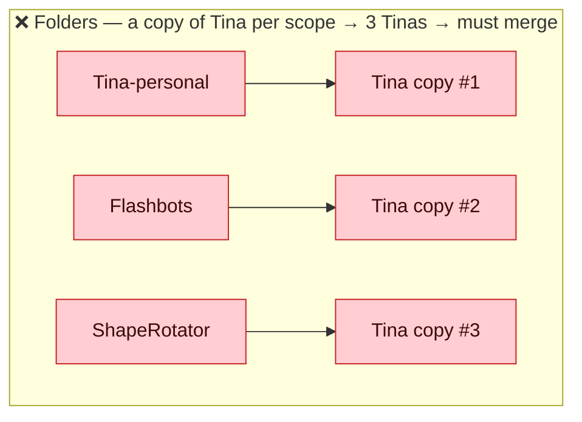
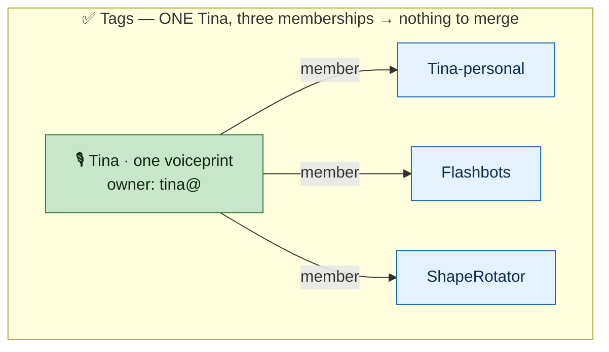
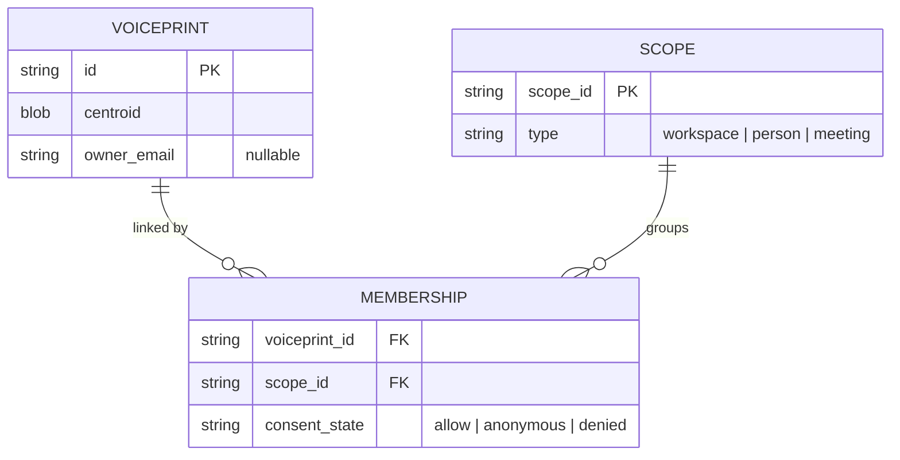
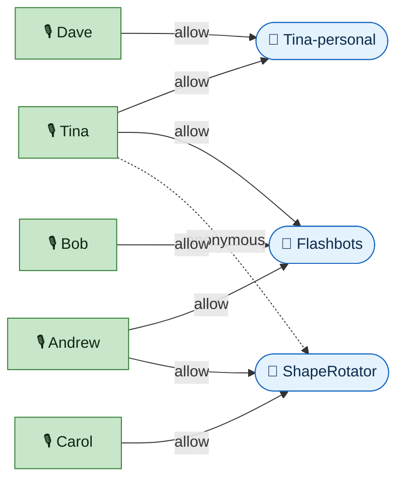
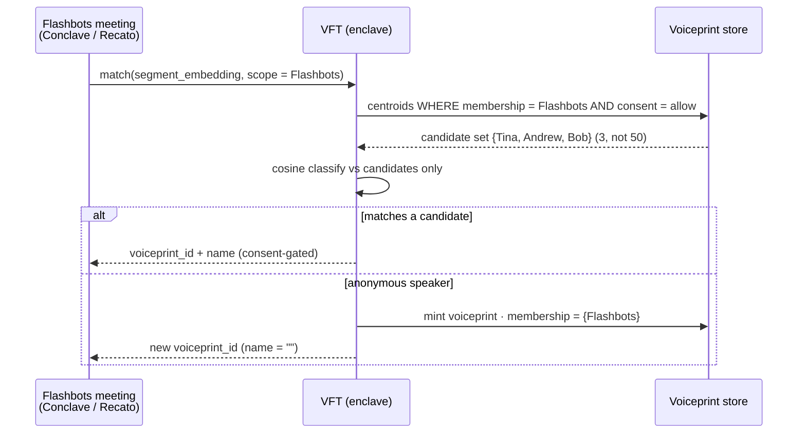
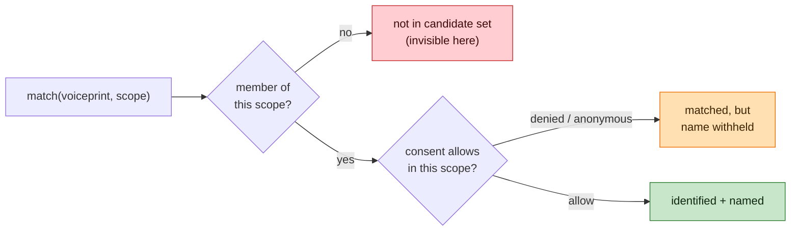

# VFT scoping model — visual

The whole design in four pictures: the mental model, the schema, your Tina example, and
what happens when a meeting runs.

---

## 1. The one idea: scopes are TAGS, not FOLDERS

The mistake that creates "merge hell": treating a scope as a **folder that contains copies** of a
voiceprint. The fix: a scope is a **tag/membership** pointing at **one** global voiceprint.





---

## 2. The schema — three primitives



- **VOICEPRINT** = the identity (global, one per real person). The biometric fact.
- **SCOPE** = a namespace / candidate-set / sharing boundary (workspace, personal, or one meeting).
- **MEMBERSHIP** = the edge. *This is the new primitive* — it carries the **per-scope consent**.

---

## 3. Your Tina example, as a picture

Voiceprints on the left, scopes on the right, each line is a membership. Notice **Tina and Andrew
each appear once** but link to multiple scopes; the overlap is shared edges, not duplicated people.



Read it:
- **Flashbots** candidate set = {Tina, Andrew, Bob}. **ShapeRotator** = {Andrew, Carol, +Tina but anonymous}.
- **Tina-personal** = {Tina, Dave} — private; Flashbots/ShapeRotator can't see it.
- The dashed **Tina→ShapeRotator (anonymous)** edge = same person, but she opted out of being named
  *there* — per-edge consent, no effect on her Flashbots identity.

---

## 4. What happens when a Flashbots meeting runs

This is the "pull 5–6 of her 50, not the whole world" behaviour — it's just *filter memberships by scope*.



---

## 5. The permission check is just two ANDed questions



`visibility = membership(voiceprint, scope) AND consent_allows(scope)`. That's the entire access model.

---

## 6. Decisions locked (2026-06-19) — identification scope + trust boundary

1. **Default search scope = the meeting's workspace.** Anonymous S1 in a workspace-W meeting is
   matched **only against W's members** (~10), never the global DB. Global flat search is forbidden
   by construction (N-blowup; see `vft-scoping-model` §funnel reasoning / accuracy-vs-N).
2. **Workspace = the shared candidate set.** All members of W share the same set — no per-member
   sub-view for the default search. The workspace is the unit.
3. **Suggestion-assist (human-in-the-loop).** On no workspace match, VFT may search across **all of
   the host's connections** (personal + every workspace they're in) to return **ranked suggestions**
   the host confirms/overrides manually. Not auto-ID, not the global DB.
4. **New identification lands in the scope where it happened.** In-workspace → workspace membership;
   personal → personal only (never enters the workspace).
5. **Two access controls on the membership edge** (distinct):
   - *subject consent* (`allow|anonymous|denied`) — the data subject's veto.
   - *adder share-level* (`private-to-adder → workspace-shared`) — controlled by whoever added them;
     **default private-to-adder**, explicit action to promote to the whole workspace (solves the
     "Adam / cyberfund guy shouldn't be a permanent SROS member" case).
   - `visibility = membership AND adder-share-grant AND subject-consent`.
6. **Trust boundary ≡ Conclave workspace (LOCKED).** Workspace membership is the unit of mutual
   voiceprint sharing/trust.

**Open (deferred):** (a) promotion mechanics for private-add → workspace-shared (who promotes, can
the subject block it, notify?); (b) deeper/nested trust boundaries (intra-workspace tiers, personal
sub-boundaries) — workspace is the boundary for now.

---

## 7. Private-overlay within a workspace (the "Artem" case, 2026-06-19)

A member can add someone to a workspace **private to themselves** for identification — usable in
*their* meetings, invisible to other members' meetings — while optionally still associating the
person with workspace knowledge. This refines §6.2 ("workspace = one shared set"): the shared set is
a **floor**, each host carries a **private overlay**.

**Membership edge carries three independent fields:**
- `added_by` — the principal who created the link.
- `id_visibility` — *adder-controlled*: `adder-only | scope-wide` (who may use the voiceprint to identify).
- `subject_consent` — *subject-controlled*: `allow | anonymous | denied` (the subject's veto).

**Host-dependent candidate set:**
```
candidate_set(host=U, scope=W) =
    { vp : membership(vp,W).consent ≠ denied
           AND ( id_visibility = scope-wide  OR  added_by = U ) }   # shared floor + U's private overlay
  ∪ { vp in U's personal scope }
```
So Artem `(in W, added_by=Tina, id_visibility=adder-only, consent=allow)` is visible in Tina's W
meetings, not in Andrew's.

**Identification ≠ knowledge:** `id_visibility=adder-only` (voiceprint private to Tina) is
independent of knowledge association (his insights may still connect to W's graph in Conclave if she
chooses). Two grants, same edge.

**Consequences (accepted):**
- Other hosts **re-mint Artem as anonymous** (a duplicate) — correct privacy behavior; resolves only
  on promotion or independent tagging.
- **Promotion `adder-only → scope-wide` widens exposure ⇒ it is a CONSENT event**, not a flag flip —
  re-check the subject's consent at the new visibility (sharpens the §6 open promotion item).
