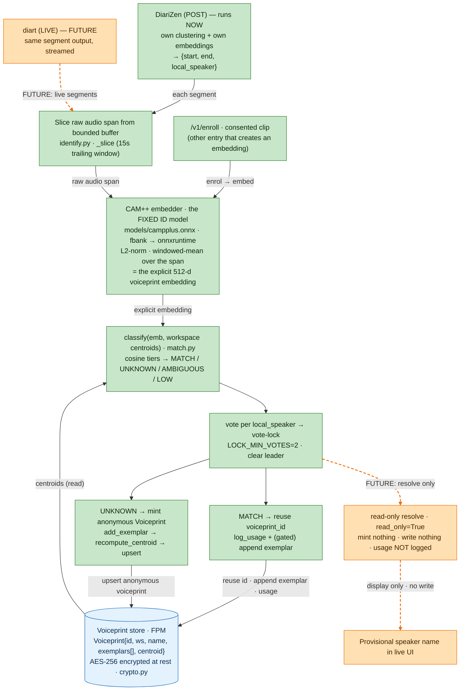

# How CAM++ voiceprint embeddings are created, stored, and used

The diarizers (**diart**, **DiariZen**) cluster with their *own* internal embeddings — those
produce only `{start, end, local_speaker}` and **never enter the store** (`identify.py`:
"the diarizer's own embeddings never enter the store"). CAM++ is a **separate, explicit**
embedding step layered on top: after diarization decides *where the speech is*, FPM re-embeds
each span with the fixed CAM++ model to decide *who it is* and to build the persistent voiceprint.

**Green = happening now. Orange dashed line = future (code exists, not wired).**

## At which point are the embeddings created?

**After** the diarizer, never before. The diarizer emits `{start, end, local_speaker}`; then per
segment FPM (`identify.py:_identify`):

1. **slices** that span's raw audio from a 15s trailing buffer (`_slice`),
2. **re-embeds** it with CAM++ (`embedder.extract` → `models/campplus.onnx`, 512-d, L2-normalized,
   windowed-mean so any-length span maps into one space),
3. **classifies** the embedding against the workspace's stored centroids (`match.classify`, cosine),
4. **votes + locks** the `local_speaker` to a `voiceprint_id`.

A second creation entry point is **enrollment** (`/v1/enroll`) — a consented clip embedded the same
way into a *named* voiceprint.

## How they're stored

A `Voiceprint{id, workspace, name, exemplars[], centroid}` — the **centroid is the mean of its
exemplar embeddings**, and it's exactly what `classify` compares new embeddings against. On a
locked segment:
- **MATCH** → reuse the existing `voiceprint_id`, log usage, and (if it passes the duration/ambiguity
  **gate**) append the embedding as a new exemplar.
- **UNKNOWN** → `_mint_anonymous`: gather gate-passing exemplars → `recompute_centroid` →
  `store.upsert` a new anonymous voiceprint (`name=""`), nameable later.

Everything in the store is **AES-256 encrypted at rest** (`crypto.py`), key from the TEE sealed-key/KMS.

## Are they actually being used right now?

**Yes — in the POST/offline pass, on every recorded meeting.** The model file is present and loaded
at startup (`main.py`; if missing, diarize/enroll are 503-disabled). Conclave's record route calls
`/v1/diarize` with `tag=offline` → `SessionIdentifier(read_only=False)` → the full
**create → classify → vote-lock → mint/append → upsert** path above runs. Because the store persists
across meetings, a returning speaker's new embedding **MATCHes** their existing centroid and reuses
the same `voiceprint_id` — that cross-meeting identification is live today.

## The future part (orange line)

The same CAM++ embeddings would drive a **live, read-only** path during the meeting. The
`read_only=True` branch already exists in `identify.py` (on lock it sets `voiceprint_id=None` for
unknowns, **skips `_mint_anonymous`, skips `store.upsert`, skips `log_usage`**) — it would *read*
centroids to classify and show a **provisional name in the live UI**, writing nothing, while the
POST pass remains the sole authoritative writer. It isn't wired because there's no live/streaming
ingress yet (Conclave only ever calls `tag=offline`), and `diart` isn't the default engine. So the
*mechanism* for live use of embeddings exists; the *invocation* is the unbuilt piece.
